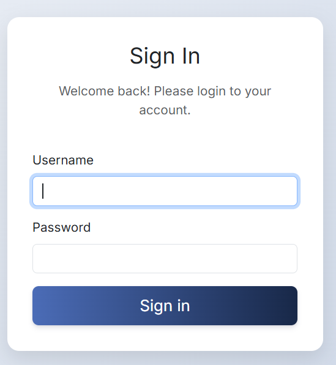
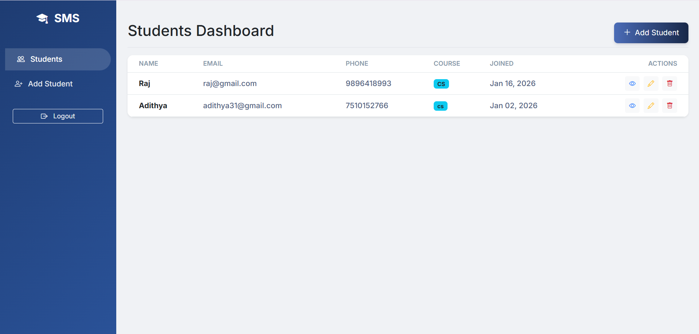
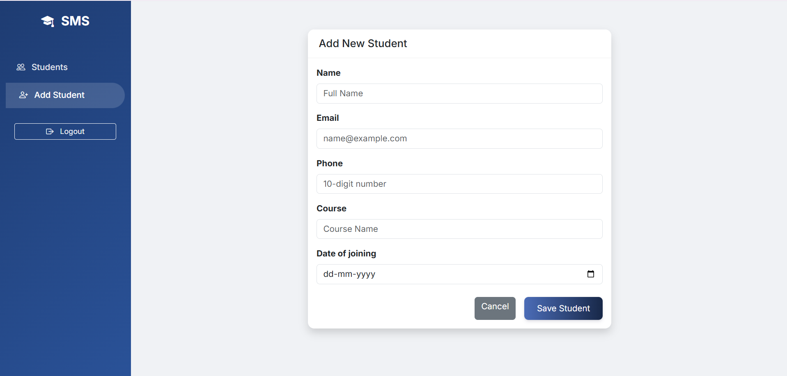
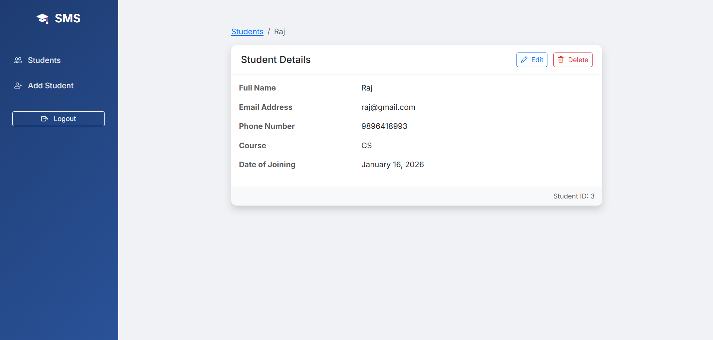

# Student Management System

A production-ready Django application for managing student records.

## Features
- **Student Management**: Create, Read, Update, and Delete (CRUD) student records.
- **Authentication**: Secure login and logout system. All views are protected.
- **Data Validation**: 
  - Phone number must be exactly 10 digits.
  - Email addresses must be unique.
- **Modern UI**: Built with Bootstrap 5 and custom styling for a premium feel (Sidebar, Glassmorphism touches).
- **Responsive Design**: Works on mobile and desktop.

## Screenshots

### Login Page


### Student List Dashboard


### Add/Edit Student Form


### Student Detail View


## Model Design
The core **Student** model includes the following fields:
- `name`: Full name of the student.
- `email`: Email address (Unique, validated).
- `phone`: Contact number (Validated for 10 digits using RegexValidator).
- `course`: Enrolled course.
- `date_of_joining`: Date of enrollment.

## Setup Instructions

Follow these steps to set up the project locally.

### Prerequisites
- Python 3.8 or higher installed on your system.

### Step 1: Create a Virtual Environment
Open your terminal in the project directory and run:

```bash
# Windows
python -m venv venv
.\venv\Scripts\activate

# Mac/Linux
python3 -m venv venv
source venv/bin/activate
```

### Step 2: Install Requirements
Install Django (and any other dependencies if listed, or just Django for now):

```bash
pip install -r requirements.txt
```

*(Note: This project uses Django 4.2 LTS)*

### Step 3: Apply Database Migrations
Initialize the SQLite database:

```bash
python manage.py makemigrations
python manage.py migrate
```

### Step 4: Create an Admin User
To access the admin panel and log in to the system (since registration is not open to public):

```bash
python manage.py createsuperuser
```
Follow the prompts to set a username and password.

### Step 5: Run the Development Server
Start the server:

```bash
python manage.py runserver
```

### Step 6: Access the Application
1. Open your browser and go to `http://127.0.0.1:8000/`.
2. You will be redirected to the Login page.
3. Log in with the superuser credentials you created in Step 4.
4. You will be directed to the Student Dashboard.

## Project Structure
- `config/`: Project main configuration (settings, urls).
- `students/`: The main app containing models, views, and forms.
- `templates/`: Global templates (base.html, login).
- `static/`: CSS and other static assets.
